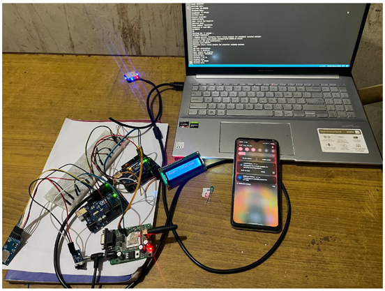

# Vehicle Accident Management System

A cost-effective embedded system that promptly detects vehicle collisions, accurately locates accident sites, and notifies nearby emergency services such as hospitals and police stations. This project integrates modern hardware modules to ensure timely response and assistance during road accidents.

---

## 🧠 Abstract

Road accidents are a leading cause of death globally, often worsened by delays in emergency assistance. This system leverages Arduino UNO, GPS, GSM, collision sensors, and SD card modules to build an efficient and reliable accident detection and notification system.

---

## 🛠️ Features

- Automatic accident detection using collision sensors
- Real-time location tracking with GPS
- Emergency alert via GSM module
- Identifies and contacts nearest hospital and police station
- Uses Haversine formula for distance calculation
- Stores responder data (coordinates, phone numbers) on SD card

---

## ⚙️ Technologies & Components Used

- **Arduino UNO**
- **YL99 Collision Sensor**
- **GPS Module (NEO 7M)**
- **GSM Module (SIM900A)**
- **SD Card Module**

---

## 🔁 Workflow

1. **Detection:** Collision sensors placed on all sides detect accidents.
2. **Location Tracking:** GPS captures real-time coordinates of the accident.
3. **Responder Matching:** Haversine formula is used to find the nearest hospital and police station from SD card records.
4. **Notification:** Emergency contacts are notified through GSM via SMS/calls.

---

## 🧪 Testing & Results

- Successfully tested under various conditions.
- Accurate location tracking except minor delays (~29s) in dense cloud areas.
- Displays real-time coordinates and contact details via serial monitor.

| Parameter              | Example Output                      |
|------------------------|-------------------------------------|
| Coordinates            | Latitude: 25.61, Longitude: 91.87   |
| Nearest Hospital       | Ganesh Das Hospital                 |
| Hospital Contact       | 7099xxxxxx09                        |
| Nearest Police Station | Mawlai Police Station              |
| Police Contact         | 8055xxxxxx87                        |

---

## ⚠️ Challenges & Limitations

### Challenges
- **Software Serial Conflicts:** Arduino UNO can't handle simultaneous GPS and GSM input.
  - **Solution:** Used dual Arduino setup with intercommunication.
  
### Limitations
- **Poor Weather Conditions:** GPS delays in dense clouds.
- **Low Signal Areas:** GSM communication fails in rural/low coverage regions.

---

## 🚀 Future Enhancements

- Add external GPS antennas for better signal reception.
- Integrate LoRa for long-range communication in low GSM coverage areas.
- Include more IoT sensors and real-time camera monitoring for enhanced reliability.

---

## 🧰 Project Structure

- `Codes/` – Arduino code files 
- `Dataset/` – Dataset of nearby hospitals and police stations 
- `Diagrams/` – Circuit and system diagrams  
- `Docs/` – Project report  
- `Images/` – Screenshots and visual assets  
- `LICENSE.md` – License information  
- `README.md` – Project overview and setup instructions

---

## 🛠️ Setup Instructions

1. **Connect Modules:**
   - Connect collision sensors to Arduino digital pins.
   - Attach GPS and GSM modules (use separate Arduinos if needed).
   - Insert SD card with hospital/police data(include your own dataset).

2. **Upload Code:**
   - Upload provided `.ino` files to Arduino using the Arduino IDE.

3. **Power Up System:**
   - Use battery or USB power supply.

4. **Testing:**
   - Simulate a collision; observe GPS output and GSM alert on serial monitor.

---

## 📄 License

This project is licensed under a **Custom License**:
- Non-commercial use only.
- Usage for research allowed **only with permission and proper credit**.
- Redistribution or claiming ownership is strictly prohibited.
